<div align="center">


# Scopeo

**Know what applies, and where to start.**

Open source regulatory scoping and gap assessment platform for the **GDPR**, **NIS2**, **DORA**, the **Cyber Resilience Act** and the **AI Act**. Runs on your machine, with no third-party service.

[](https://github.com/raymondboustany/scopeo/actions/workflows/ci.yml)
[](https://github.com/raymondboustany/scopeo/releases/latest)
[](LICENSE)
[](CHANGELOG.md)

**English** · [Français](#français)

[Quick start](#quick-start) · [Features](#features) · [Sample reports](#sample-reports) · [Roadmap](ROADMAP.md) · [Contributing](CONTRIBUTING.md)

<br>

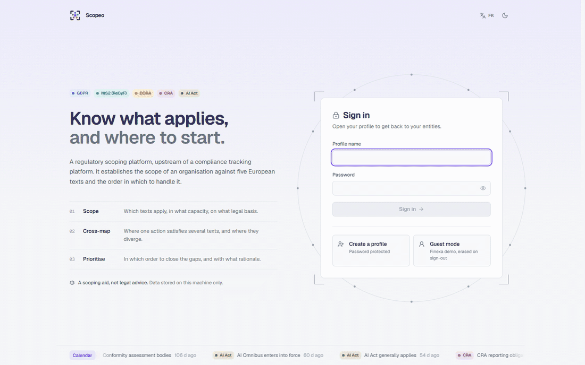

</div>

---

## Why

Five European texts now govern the security, data and AI systems of organisations. They overlap, sometimes diverge, and in some cases one overrides another (DORA over NIS2 for financial entities, for instance). Before committing a compliance budget, an organisation has to answer four questions:

1. **Which texts apply**, and in what capacity?
2. **What exactly do they require**?
3. **Where does a single action satisfy several of them**?
4. **Where to start**?

Scopeo answers them in a few hours of interviews, with reasoning that can be checked article by article, and produces the deliverables a management team expects.

> **Positioning.** The platform works **upstream**: scoping and diagnosis. It does not verify evidence or run compliance over time; those roles belong to an audit and a tracking platform, which can take over.
>
> **A scoping aid, not legal advice.** Conclusions rest on the information declared and on the state of the law at the corpus date.
>
> **Applied to France.** NIS2 is read through ANSSI's Référentiel Cyber France (ReCyF), and the authorities named are the French ones (CNIL, ANSSI, ACPR, AMF).

---

## Features

<table>
<tr>
<td width="50%" valign="top">

### Scoping you can defend
35 questions, each tied to the article it establishes. Every verdict shows its conditions, caveats and maximum penalty. The **before / after comparator** shows which obligations enter or leave the scope when an answer changes.

</td>
<td width="50%">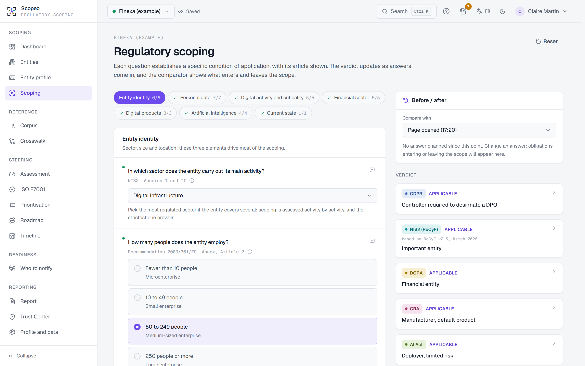</td>
</tr>
<tr>
<td width="50%">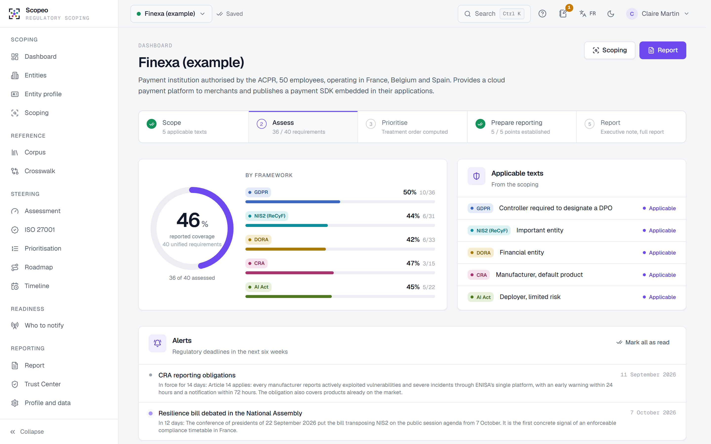</td>
<td width="50%" valign="top">

### Diagnosis at a glance
Overall and per-framework coverage, a five-step scoping path, alerts on upcoming regulatory deadlines, priorities and weaknesses by domain.

</td>
</tr>
<tr>
<td width="50%" valign="top">

### Shared requirements
40 unified requirements link the obligations of the five texts. The **Shared actions** view shows which combinations of texts a single action covers; divergences and precedence are named, with the rule that prevails.

</td>
<td width="50%">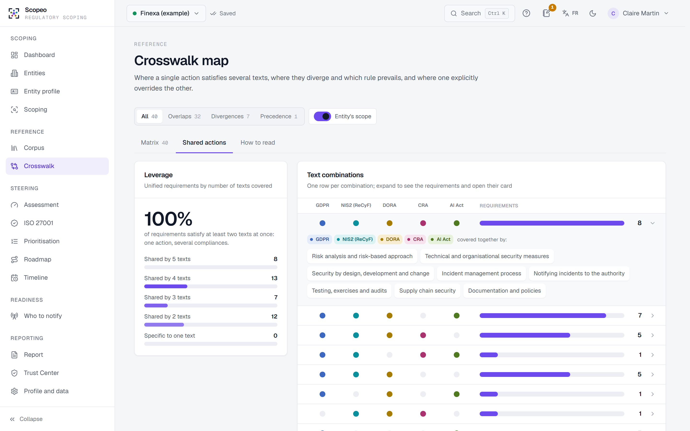</td>
</tr>
<tr>
<td width="50%">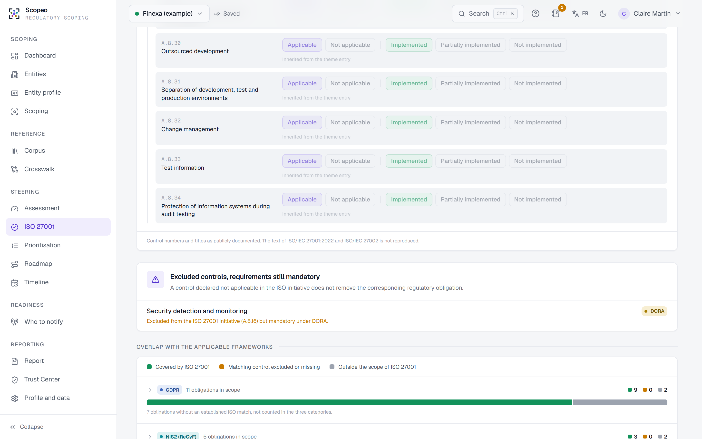</td>
<td width="50%" valign="top">

### Optional ISO 27001 module
Declare the 93 Annex A controls by theme or one by one, or import a Statement of Applicability. Matching NIS2, DORA and CRA requirements are pre-filled and stay editable; an alert flags controls marked not applicable where a text still requires them; a chart splits each framework into what ISO covers, what it could cover, and what lies outside its scope. The module can always be skipped.

</td>
</tr>
<tr>
<td width="50%" valign="top">

### NIS2 detailed by the ReCyF
Under the NIS2 requirements, the **152 measures of ANSSI's ReCyF** (v2.5, March 2026 working version), filtered by entity category. A valid ISO 27001 certificate over the whole scope is recognised for objectives 2 and 16, as the ReCyF provides.

</td>
<td width="50%">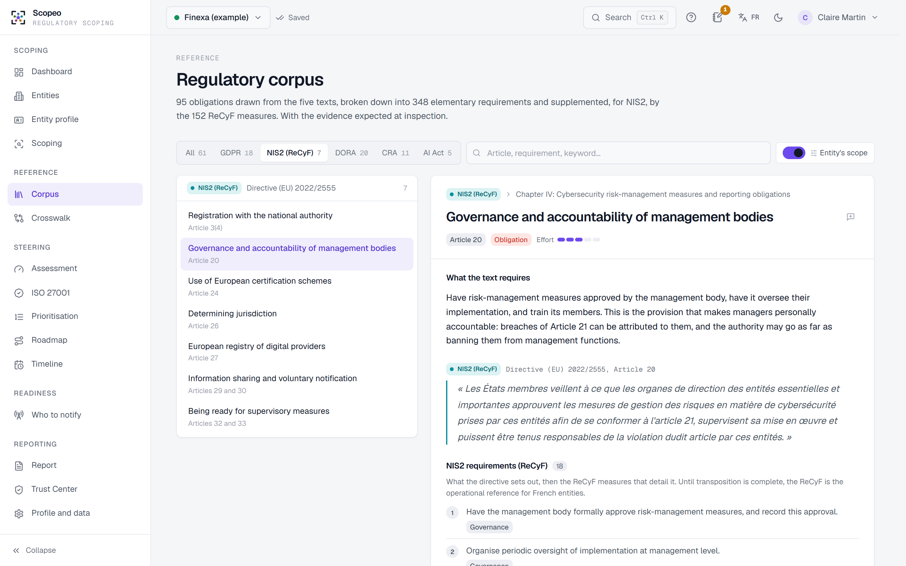</td>
</tr>
<tr>
<td width="50%">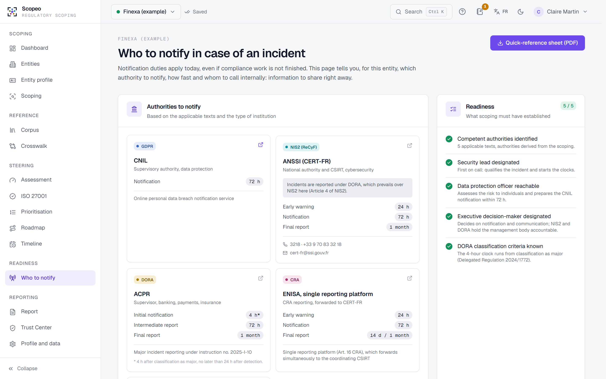</td>
<td width="50%" valign="top">

### Who to notify, starting today
Notification duties apply before compliance work is done. The platform names the authorities (CNIL, ANSSI, ACPR or AMF, ENISA, market surveillance for AI), their deadlines and the internal escalation chain, and produces a one-page **incident quick-reference sheet**.

</td>
</tr>
</table>

**Also included:** three-state assessment (in place, partial, missing) · adjustable prioritisation and a four-wave roadmap · interactive timeline · entity profile (client or internal scoping) · interview notes and log · Trust Center (read-only public view, currently local only) · global search (<kbd>Ctrl</kbd> + <kbd>K</kbd>) · English and French interface · light and dark themes · guided tour · password-protected profiles.

<details>
<summary>Dark theme preview</summary>
<br>
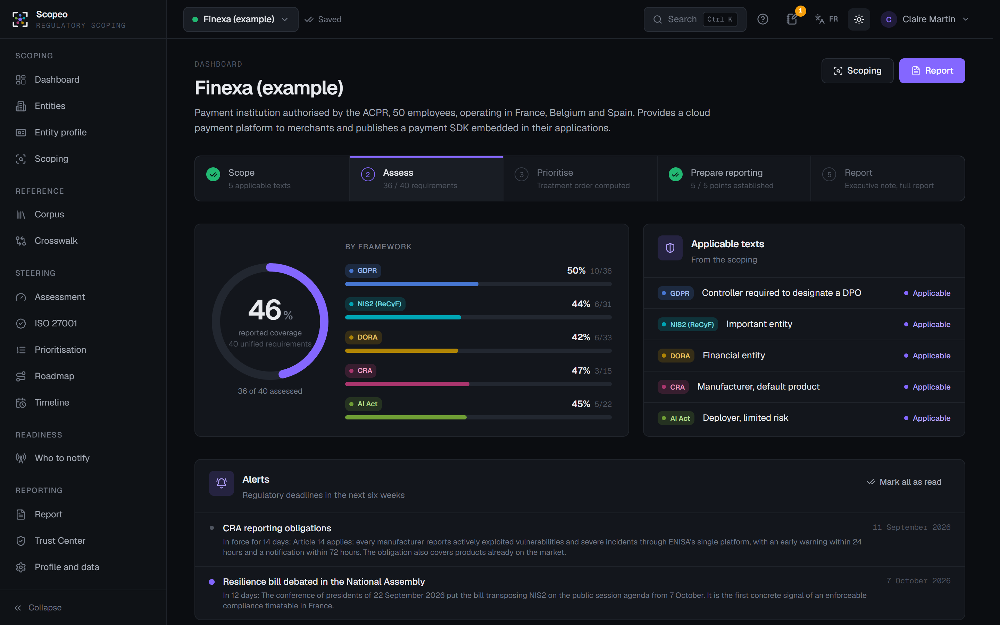
</details>

---

## Sample reports

Three PDF deliverables, generated from the fictitious demo entity *Finexa*:

| Document | Audience | Length |
|---|---|---|
| [Executive summary](docs/samples/executive-summary-finexa.pdf) | Management, executive committee | 2 pages |
| [Full scoping report](docs/samples/scoping-report-finexa.pdf) | Counsel, CISO, DPO, project team | 6 to 12 pages |
| [Incident quick-reference sheet](docs/samples/incident-quick-reference-finexa.pdf) | Internal distribution | 1 page |

---

## Quick start

> **First install?** The [step-by-step installation guide](docs/installation.md) covers every step, with no technical prerequisite.

### Docker Compose (recommended)

Prerequisite: [Docker Desktop](https://www.docker.com/products/docker-desktop/).

```bash
mkdir scopeo && cd scopeo
curl -o compose.yaml https://raw.githubusercontent.com/raymondboustany/scopeo/main/compose.yaml
docker compose up -d
```

Then open **http://localhost:8000**. Data is kept in the `scopeo-data` Docker volume.

### Without Docker

Prerequisite: [Python 3.11+](https://www.python.org/downloads/).

1. Download `scopeo-vX.Y.Z-portable.zip` from the [latest release](https://github.com/raymondboustany/scopeo/releases/latest) and unzip it.
2. Run `start.bat` (Windows, double-click) or `./start.sh` (macOS, Linux).

### From source

Prerequisites: Node.js 20+, Python 3.11+, Git.

```bash
git clone https://github.com/raymondboustany/scopeo.git
cd scopeo
npm install
npm run setup      # Python environment for the server
npm run dev        # http://localhost:5173, with hot reload
```

<details>
<summary>Commands and configuration</summary>
<br>

| Command | Purpose |
|---|---|
| `npm run dev` | API with reload and Vite interface, stopped together |
| `npm start` | Build, then serve the platform on http://127.0.0.1:8000 |
| `npm test` · `npm run test:server` | Engine tests (Vitest) · API tests (pytest) |
| `npm run lint` · `npm run typecheck` | Static checks |
| `npm run demo:build` | Regenerate the demo entity |

| Environment variable | Default | Purpose |
|---|---|---|
| `SCOPEO_PORT` | `8000` | Server port |
| `SCOPEO_HOST` | `127.0.0.1` | Listening address |
| `SCOPEO_DATA_DIR` | `server/data` (`/data` under Docker) | SQLite database folder |
| `SCOPEO_COOKIE_SECURE` | off | Mark the session cookie `Secure` when served over HTTPS |

</details>

### First steps

On the home page, choose **Guest mode** to explore the *Finexa* demo, a 50-person payment institution already scoped and assessed; it is erased on sign-out. To scope your own organisation or a client, create a password-protected profile, then an entity. The language switch sits in the top bar.

---

## Reference

| | |
|---|---|
| Texts | GDPR, NIS2 (ReCyF), DORA, CRA, AI Act |
| Obligations | 95 (GDPR 21, NIS2 22, DORA 22, CRA 12, AI Act 18) |
| Elementary requirements | 348, with expected evidence, deadlines and penalty tier |
| Unified requirements | 40, including 7 divergences and 1 precedence rule |
| NIS2 detail (ReCyF v2.5) | 20 objectives, 152 measures |
| ISO/IEC 27001:2022 | 93 Annex A controls (public titles only), mapped by theme |
| Scoping questions | 35, each tied to the article it establishes |

<details>
<summary>Status of the texts and notification deadlines</summary>
<br>

| Text | Reference | Status on 24 September 2026 |
|---|---|---|
| GDPR | Regulation (EU) 2016/679 | Applicable since 25 May 2018 |
| NIS2 | Directive (EU) 2022/2555 | Not yet transposed in France; resilience bill debated from 7 October 2026. Requirements detailed by the ReCyF v2.5, a working document that may change before the implementing decree |
| DORA | Regulation (EU) 2022/2554 | Applicable since 17 January 2025 |
| CRA | Regulation (EU) 2024/2847 | Reporting (Art. 14) since 11 September 2026; full application on 11 December 2027 |
| AI Act | Regulation (EU) 2024/1689, amended by Regulation (EU) 2026/1744 | Prohibitions and AI literacy since 2 February 2025; general application since 2 August 2026; high-risk systems on 2 December 2027 (Annex III) and 2 August 2028 (Annex I) |

| Regime | Deadlines | Basis |
|---|---|---|
| GDPR | 72 h after awareness | Art. 33 |
| NIS2 | early warning 24 h · notification 72 h · final report 1 month | Art. 23(4) |
| DORA | initial notification 4 h after classification as major, at the latest 24 h after detection · intermediate report 72 h · final report 1 month | Art. 19, Delegated Regulation (EU) 2025/301 |
| CRA | early warning 24 h · notification 72 h · final report 14 days after a fix (vulnerability) or 1 month (incident) | Art. 14 |
| AI Act | serious incident: 15 days, 10 days in case of death, 2 days for a widespread infringement or critical infrastructure | Art. 73 |

</details>

Official texts are kept as PDF in [texts/](texts/README.md), with their reuse conditions. Corpus changes are recorded in the [changelog](CHANGELOG.md).

---

## Architecture

```
┌──────────────────────────────┐        ┌───────────────────────────┐
│ Interface: React, TypeScript │  /api  │ Server: FastAPI           │
│ Regulatory engines           │ ─────► │ SQLite persistence        │
│ PDF reports                  │        │ Profiles and sessions     │
└──────────────────────────────┘        └───────────────────────────┘
```

All regulatory logic (scoping, scope, prioritisation, deadlines, ISO mapping) runs in the interface from the stored answers, so a corpus update applies at once to every existing entity. The server stores data and handles authentication.

**Stack:** React 19, TypeScript, Vite, Tailwind CSS 4, Radix UI, TanStack Query, @react-pdf/renderer · FastAPI, SQLModel, SQLite, bcrypt · Vitest, pytest.

---

## Privacy and security

- Data stays on the machine: no telemetry, no call to a third-party service.
- Each profile is protected by a password, hashed with bcrypt and never stored in clear. Sessions are server-side, carried by an `HttpOnly`, `SameSite=Strict` cookie, and revoked on sign-out.
- The server listens on `127.0.0.1` by default. Read [SECURITY.md](SECURITY.md) before exposing it on a network.
- The Trust Center is still a demo feature: it only works locally for now. Online sharing will come in a future update.

---

## Contributing

Contributions are welcome, especially **corpus updates**, to be reported with an official source through the "Regulatory update" issue template. Every change goes through a pull request reviewed and approved by the maintainer. See the [contributing guide](CONTRIBUTING.md).

## Licence

Code released under the [MIT](LICENSE) licence. Regulatory texts remain the property of their authors; their reuse conditions are listed in [texts/README.md](texts/README.md). ISO/IEC 27001 control titles are cited as publicly documented; the text of the standard is not reproduced.

---

<a id="français"></a>

<div align="center">

## Français

**Savoir ce qui s'applique, et par quoi commencer.**

Plateforme open source de cadrage et de diagnostic réglementaire pour le **RGPD**, **NIS2**, **DORA**, le **Cyber Resilience Act** et l'**AI Act**. Elle fonctionne sur votre poste, sans service tiers.

[English](#scopeo) · **Français**

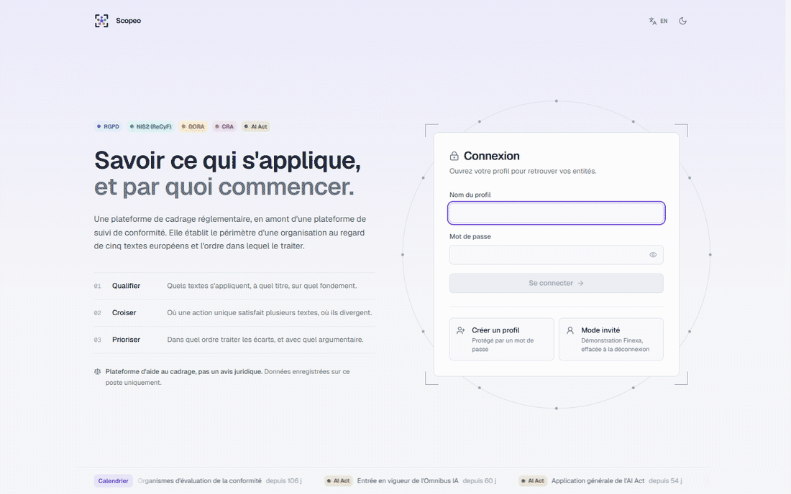

</div>

### Pourquoi

Cinq textes européens encadrent désormais la sécurité, les données et les systèmes d'IA des organisations. Ils se recouvrent, divergent parfois, et l'un prime sur l'autre dans certains cas (DORA sur NIS2 pour les entités financières, par exemple). Avant d'engager un budget de conformité, une organisation doit savoir quels textes s'appliquent et à quel titre, ce qu'ils exigent précisément, où une seule action en satisfait plusieurs, et par quoi commencer.

Scopeo y répond en quelques heures d'entretien, avec un raisonnement vérifiable article par article, et produit les livrables attendus par une direction.

> **Positionnement.** La plateforme intervient **en amont** : cadrage et diagnostic. Elle ne vérifie pas de preuves et ne pilote pas la conformité dans la durée.
>
> **Aide au cadrage, pas un avis juridique.** Les conclusions reposent sur les éléments déclarés et sur l'état du droit à la date du corpus.
>
> **Appliquée à la France.** NIS2 est lu à travers le Référentiel Cyber France (ReCyF) de l'ANSSI, et les autorités désignées sont les autorités françaises.

### Fonctionnalités

<table>
<tr>
<td width="50%" valign="top">

#### Qualification démontrée
35 questions, chacune rattachée à l'article qu'elle établit. Chaque verdict expose ses conditions, ses réserves et la sanction plafond. Le **comparateur avant / après** montre les obligations qui entrent ou sortent du périmètre.

</td>
<td width="50%">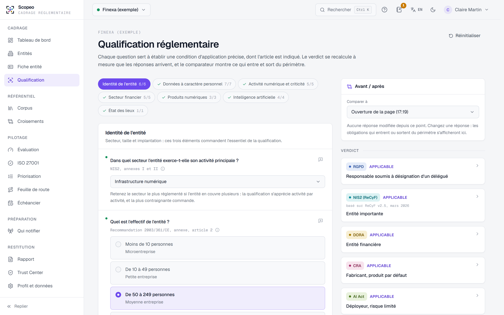</td>
</tr>
<tr>
<td width="50%">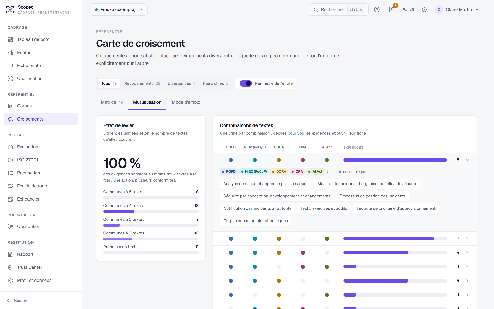</td>
<td width="50%" valign="top">

#### Exigences mutualisées
40 exigences unifiées relient les obligations des cinq textes. La vue **Mutualisation** montre les combinaisons de textes couvertes par une action unique ; divergences et hiérarchies sont nommées, avec la règle qui commande.

</td>
</tr>
<tr>
<td width="50%" valign="top">

#### Module ISO 27001 facultatif
Déclaration des 93 contrôles de l'annexe A par thème ou contrôle par contrôle, ou import d'une déclaration d'applicabilité. Les exigences NIS2, DORA et CRA correspondantes sont pré-remplies et restent modifiables ; une alerte signale les contrôles exclus alors qu'un texte les impose ; un graphique répartit chaque référentiel entre ce qu'ISO couvre, ce qu'il pourrait couvrir et ce qui échappe à son champ. Le module reste toujours contournable.

</td>
<td width="50%">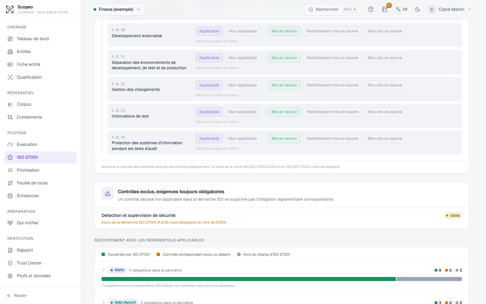</td>
</tr>
<tr>
<td width="50%">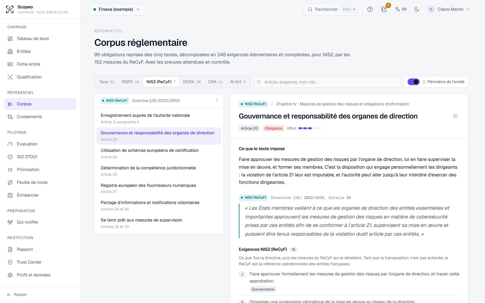</td>
<td width="50%" valign="top">

#### NIS2 détaillé par le ReCyF
Sous les exigences NIS2, les **152 mesures du ReCyF** de l'ANSSI (v2.5, version de travail de mars 2026), filtrées selon la catégorie de l'entité.

</td>
</tr>
</table>

**Et aussi :** évaluation à trois états · priorisation et feuille de route en quatre vagues · échéancier interactif · qui notifier en cas d'incident et fiche réflexe · notes d'entretien · Trust Center (démonstration, en local pour l'instant) · recherche transverse · interface en français et en anglais · thème clair et sombre · profils protégés par mot de passe.

### Rapports d'exemple

| Document | Destinataires | Format |
|---|---|---|
| [Note au comité de direction](docs/samples/note-comex-finexa.pdf) | Direction, COMEX | 2 pages |
| [Rapport de cadrage complet](docs/samples/rapport-cadrage-finexa.pdf) | Conseil, RSSI, DPO, équipe projet | 6 à 12 pages |
| [Fiche réflexe incident](docs/samples/fiche-reflexe-finexa.pdf) | Diffusion interne | 1 page |

### Démarrage rapide

Le [guide d'installation](docs/installation.md) détaille chaque étape. En bref, avec Docker Desktop :

```bash
mkdir scopeo && cd scopeo
curl -o compose.yaml https://raw.githubusercontent.com/raymondboustany/scopeo/main/compose.yaml
docker compose up -d
```

Ouvrez ensuite **http://localhost:8000**. Sans Docker, téléchargez l'archive portable de la [dernière version](https://github.com/raymondboustany/scopeo/releases/latest) et lancez `start.bat` ou `./start.sh`.

À l'accueil, **Mode invité** ouvre la démonstration *Finexa*, effacée à la déconnexion. Pour cadrer votre organisation ou un client, créez un profil protégé par mot de passe, puis une entité.

### Confidentialité et sécurité

- Les données ne quittent pas le poste : aucune télémétrie, aucun appel à un service tiers.
- Chaque profil est protégé par un mot de passe haché avec bcrypt, jamais conservé en clair. La session est tenue côté serveur et révoquée à la déconnexion.
- Le Trust Center est encore une fonction de démonstration, utilisable en local uniquement ; le partage en ligne arrivera dans une prochaine mise à jour.
- Voir [SECURITY.md](SECURITY.md) avant toute exposition sur un réseau.

### Contribuer

Les contributions sont bienvenues, en particulier les mises à jour du corpus avec une source officielle. Toute modification passe par une pull request relue et approuvée par le mainteneur. Voir le [guide de contribution](CONTRIBUTING.md).

### Licence

Code publié sous licence [MIT](LICENSE). Les textes réglementaires restent la propriété de leurs auteurs ; voir [texts/README.md](texts/README.md).
