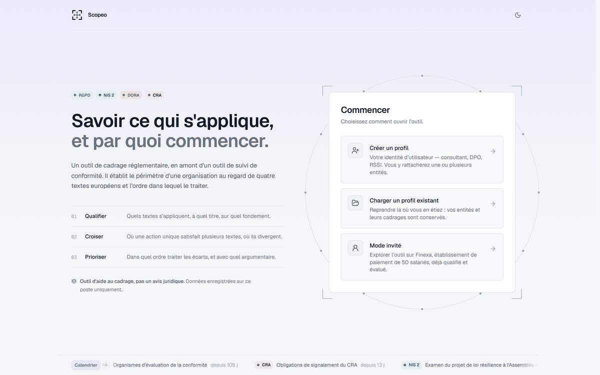
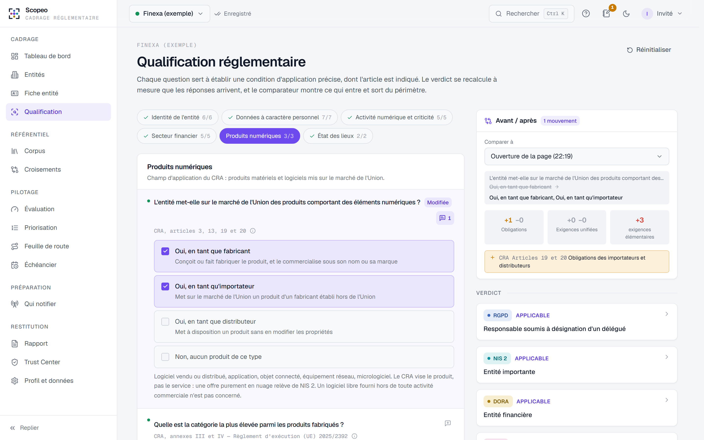
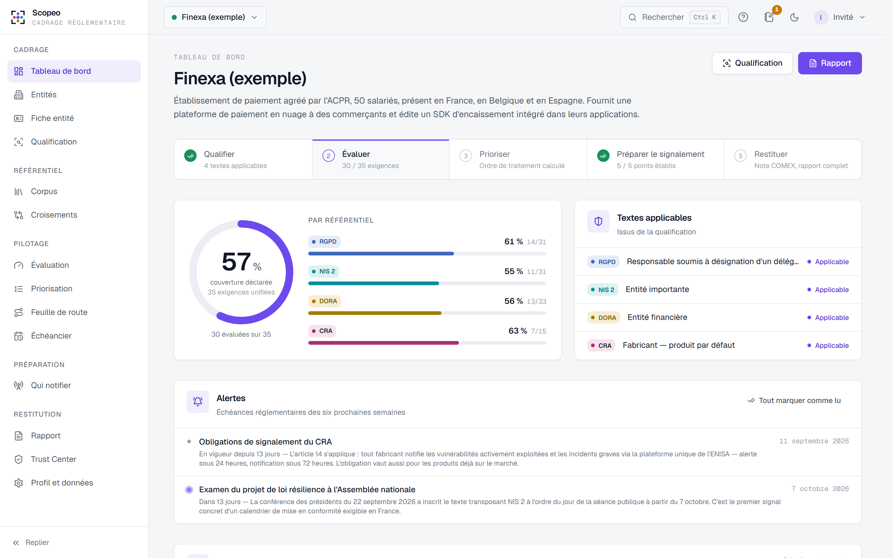
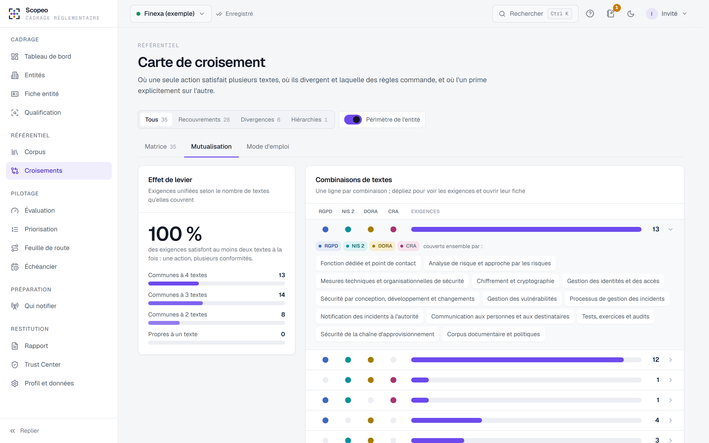
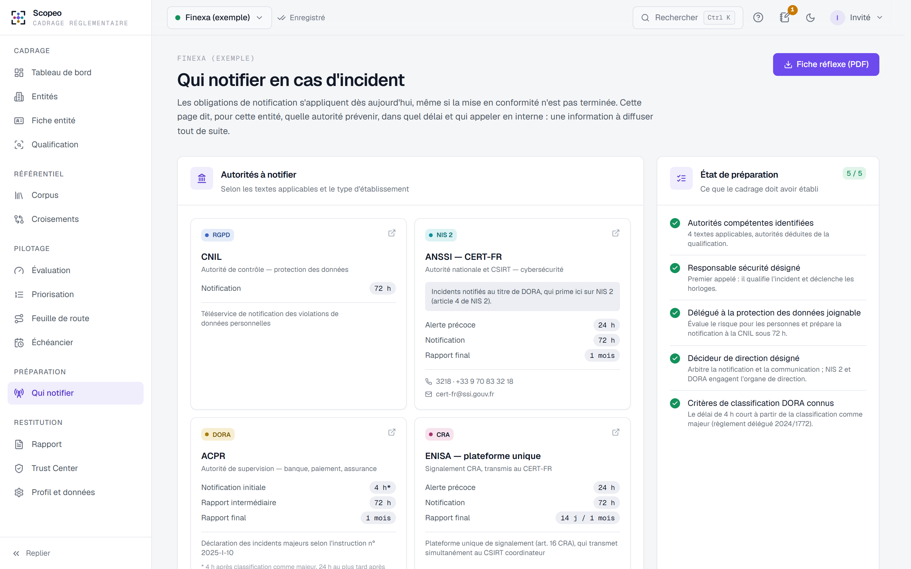
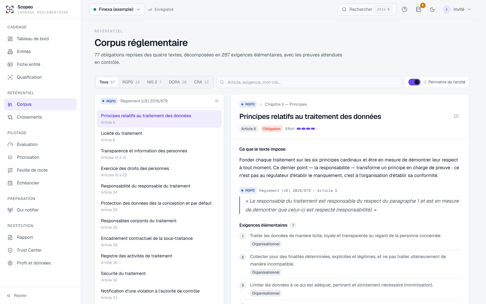
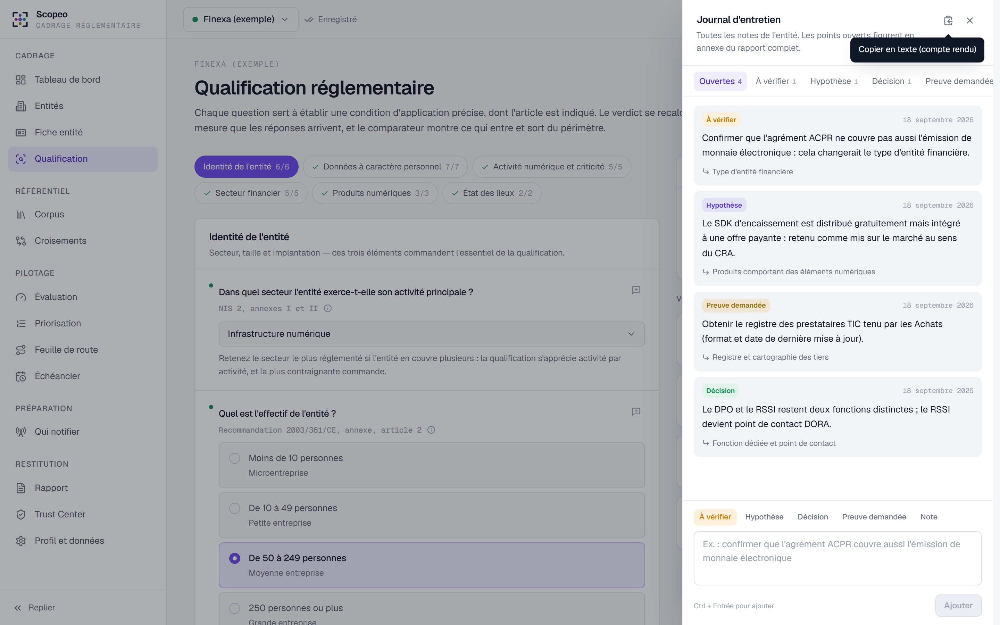
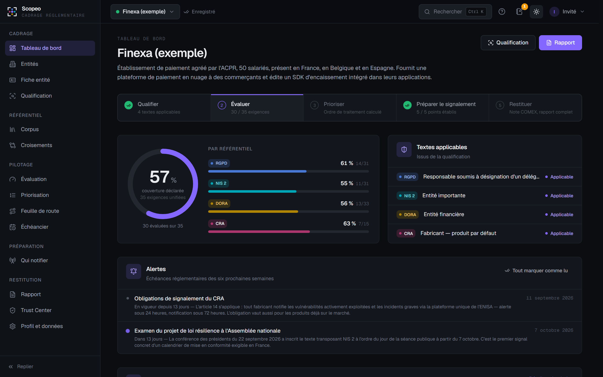

<div align="center">


# Scopeo

**Savoir ce qui s'applique, et par quoi commencer.**

Outil open source de cadrage et de diagnostic réglementaire pour le **RGPD**, **NIS 2**, **DORA** et le **Cyber Resilience Act** — sur votre poste, sans compte ni service tiers.

[](https://github.com/raymondboustany/scopeo/actions/workflows/ci.yml)
[](https://github.com/raymondboustany/scopeo/releases/latest)
[](LICENSE)
[](CHANGELOG.md)

[Démarrage rapide](#démarrage-rapide) · [Fonctionnalités](#fonctionnalités) · [Rapports d'exemple](#rapports-dexemple) · [Feuille de route](ROADMAP.md) · [Contribuer](CONTRIBUTING.md)

<br>



</div>

---

## Pourquoi

Quatre textes européens encadrent désormais la sécurité et les données des organisations. Ils se recouvrent, divergent parfois, et l'un prime sur l'autre dans certains cas — DORA sur NIS 2 pour les entités financières, par exemple. Avant d'engager un budget de conformité, une organisation doit répondre à quatre questions :

1. **Quels textes s'appliquent**, et à quel titre ?
2. **Qu'exigent-ils précisément** ?
3. **Où une seule action en satisfait-elle plusieurs** ?
4. **Par quoi commencer** ?

Scopeo y répond en quelques heures d'entretien, avec un raisonnement vérifiable article par article, et produit les livrables attendus par une direction.

> **Positionnement.** L'outil intervient **en amont** : cadrage et diagnostic. Il ne vérifie pas de preuves et ne pilote pas la conformité dans la durée — ces rôles reviennent à un audit et à un outil de suivi, qui peuvent prendre le relais.
>
> **Outil d'aide au cadrage, pas un avis juridique.** Les conclusions reposent sur les éléments déclarés et sur l'état du droit à la date du corpus.

---

## Fonctionnalités

<table>
<tr>
<td width="50%" valign="top">

### Qualification démontrée
Une trentaine de questions, chacune rattachée à l'article qu'elle sert à établir. Chaque verdict expose ses conditions, ses réserves et la sanction plafond. Le **comparateur avant / après** montre les obligations qui entrent ou sortent du périmètre quand une réponse change.

</td>
<td width="50%"></td>
</tr>
<tr>
<td width="50%"></td>
<td width="50%" valign="top">

### Diagnostic en un coup d'œil
Couverture globale et par texte, parcours de cadrage en cinq étapes, alertes sur les échéances réglementaires proches, priorités et faiblesses par domaine.

</td>
</tr>
<tr>
<td width="50%" valign="top">

### Exigences mutualisées
35 exigences unifiées relient les obligations des quatre textes. La vue **Mutualisation** montre quelles combinaisons de textes une action unique permet de couvrir ; les divergences et hiérarchies sont nommées, avec la règle qui commande.

</td>
<td width="50%"></td>
</tr>
<tr>
<td width="50%"></td>
<td width="50%" valign="top">

### Qui notifier, dès aujourd'hui
Les obligations de notification s'appliquent avant même la mise en conformité. L'outil désigne les autorités (CNIL, ANSSI, ACPR ou AMF, ENISA), leurs délais et la chaîne d'escalade interne, et produit une **fiche réflexe** d'une page.

</td>
</tr>
<tr>
<td width="50%" valign="top">

### Corpus consultable
77 obligations et 287 exigences élémentaires, avec les preuves attendues en contrôle. Sous les exigences NIS 2, le **détail d'implémentation de l'ANSSI** (ReCyF), filtré selon la catégorie de l'entité.

</td>
<td width="50%"></td>
</tr>
<tr>
<td width="50%"></td>
<td width="50%" valign="top">

### Notes d'entretien
Une note se pose sur une question, une exigence ou un article, avec une étiquette : *à vérifier*, *hypothèse*, *décision*, *preuve demandée*. Le journal d'entretien les rassemble ; le rapport complet reprend les points ouverts en annexe.

</td>
</tr>
</table>

**Et aussi** — évaluation à trois états (en place, partiel, absent) · priorisation pondérable et feuille de route en quatre vagues · échéancier interactif · fiche entité (cadrage d'un client ou cadrage interne) · Trust Center : vue publique en lecture seule par lien révocable · recherche transverse (<kbd>Ctrl</kbd> + <kbd>K</kbd>) · thème clair et sombre · parcours guidé.

<details>
<summary>Aperçu du thème sombre</summary>
<br>

</details>

---

## Rapports d'exemple

Trois livrables PDF, générés à partir de l'entité de démonstration fictive *Finexa* :

| Document | Destinataires | Format |
|---|---|---|
| [Note au comité de direction](docs/samples/note-comex-finexa.pdf) | Direction, COMEX | 2 pages |
| [Rapport de cadrage complet](docs/samples/rapport-cadrage-finexa.pdf) | Conseil, RSSI, DPO, équipe projet | 9 pages |
| [Fiche réflexe incident](docs/samples/fiche-reflexe-finexa.pdf) | Diffusion interne | 1 page |

---

## Démarrage rapide

> **Première installation ?** Le [guide d'installation pas à pas](docs/installation.md) détaille chaque étape, sans prérequis technique.

### Docker Compose (recommandé)

Prérequis : [Docker Desktop](https://www.docker.com/products/docker-desktop/).

```bash
mkdir scopeo && cd scopeo
curl -o compose.yaml https://raw.githubusercontent.com/raymondboustany/scopeo/main/compose.yaml
docker compose up -d
```

Ouvrez ensuite **http://localhost:8000**. Les données sont conservées dans le volume Docker `scopeo-data`.

### Docker

```bash
docker run -d --restart=unless-stopped -p 127.0.0.1:8000:8000 -v scopeo-data:/data --name scopeo ghcr.io/raymondboustany/scopeo:latest
```

### Sans Docker

Prérequis : [Python 3.11+](https://www.python.org/downloads/).

1. Téléchargez `scopeo-vX.Y.Z-portable.zip` depuis la [dernière version](https://github.com/raymondboustany/scopeo/releases/latest) et décompressez-la.
2. Lancez `start.bat` (Windows, double-clic) ou `./start.sh` (macOS, Linux).

Le premier lancement installe les dépendances, puis ouvre le navigateur sur l'application.

### Mise à jour

| Installation | Commande |
|---|---|
| Docker Compose | `docker compose pull && docker compose up -d` |
| Docker | `docker pull ghcr.io/raymondboustany/scopeo:latest`, puis recréer le conteneur |
| Sans Docker | Télécharger la nouvelle archive et y copier le dossier `server/data` |

> **Sécurité** — L'application n'intègre pas d'authentification et n'écoute que sur le poste local. Lisez [SECURITY.md](SECURITY.md) avant de l'exposer sur un réseau.

### Installation depuis les sources

Pour contribuer ou modifier le projet. Prérequis : Node.js 20+, Python 3.11+, Git.

```bash
git clone https://github.com/raymondboustany/scopeo.git
cd scopeo
npm install
npm run setup      # environnement Python du serveur
npm run dev        # http://localhost:5173, avec rechargement automatique
```

<details>
<summary>Commandes et configuration avancée</summary>
<br>

| Commande | Rôle |
|---|---|
| `npm run dev` | API avec rechargement et interface Vite, arrêtées ensemble |
| `npm start` | Compilation, puis service de l'application sur http://127.0.0.1:8000 |
| `npm test` · `npm run test:server` | Tests des moteurs (Vitest) · tests de l'API (pytest) |
| `npm run lint` · `npm run typecheck` | Contrôles statiques |
| `npm run demo:build` | Régénère l'entité de démonstration |
| `docker compose build` | Construit l'image Docker à partir des sources |

| Variable d'environnement | Défaut | Rôle |
|---|---|---|
| `SCOPEO_PORT` | `8000` | Port du serveur |
| `SCOPEO_HOST` | `127.0.0.1` | Adresse d'écoute |
| `SCOPEO_DATA_DIR` | `server/data` (`/data` sous Docker) | Dossier de la base SQLite |

</details>

### Premiers pas

À l'accueil, choisissez **Mode invité** pour explorer la démonstration *Finexa* — un établissement de paiement de 50 salariés, déjà qualifié et évalué. Un parcours guidé présente l'outil. Pour cadrer votre propre organisation ou un client, créez un profil puis une entité.

---

## Référentiel

| | |
|---|---|
| Textes | RGPD, NIS 2, DORA, CRA |
| Obligations | 77 (RGPD 21, NIS 2 22, DORA 22, CRA 12) |
| Exigences élémentaires | 287, avec preuves attendues, échéances et palier de sanction |
| Exigences unifiées | 35, dont 6 divergences et 1 hiérarchie |
| Détail ANSSI (ReCyF v2.5) | 20 objectifs, 152 mesures |
| Questions de qualification | 30, chacune rattachée à l'article qu'elle établit |

<details>
<summary>État des textes et délais de notification retenus</summary>
<br>

| Texte | Référence | État au 23 septembre 2026 |
|---|---|---|
| RGPD | Règlement (UE) 2016/679 | Applicable depuis le 25 mai 2018 |
| NIS 2 | Directive (UE) 2022/2555 | Non transposée en France ; projet de loi résilience examiné à partir du 7 octobre 2026 |
| DORA | Règlement (UE) 2022/2554 | Applicable depuis le 17 janvier 2025 |
| CRA | Règlement (UE) 2024/2847 | Signalement (art. 14) depuis le 11 septembre 2026 ; application complète le 11 décembre 2027 |

| Régime | Délais | Fondement |
|---|---|---|
| RGPD | 72 h après la prise de connaissance | art. 33 |
| NIS 2 | alerte 24 h · notification 72 h · rapport final 1 mois | art. 23 § 4 |
| DORA | notification initiale 4 h après classification comme majeur, au plus tard 24 h après détection · rapport intermédiaire 72 h · rapport final 1 mois | art. 19, règlement délégué (UE) 2025/301 |
| CRA | alerte 24 h · notification 72 h · rapport final 14 jours après correctif (vulnérabilité) ou 1 mois (incident) | art. 14 |

</details>

Les sources et leurs conditions de réutilisation sont détaillées dans [texts/README.md](texts/README.md). Les évolutions du corpus sont consignées dans le [journal des modifications](CHANGELOG.md).

---

## Architecture

```
┌──────────────────────────────┐        ┌──────────────────────────┐
│ Interface — React, TypeScript│  /api  │ Serveur — FastAPI         │
│ Moteurs réglementaires       │ ─────► │ Persistance SQLite        │
│ Rapports PDF                 │        │ Aucune logique métier     │
└──────────────────────────────┘        └──────────────────────────┘
```

Toute la logique réglementaire — qualification, périmètre, priorisation, délais — s'exécute dans l'interface à partir des réponses enregistrées. Une évolution du corpus s'applique ainsi immédiatement à toutes les entités existantes. Le serveur ne fait que conserver les données.

**Pile technique** — React 19, TypeScript, Vite, Tailwind CSS 4, Radix UI, TanStack Query, D3, @react-pdf/renderer · FastAPI, SQLModel, SQLite · Vitest, pytest.

---

## Confidentialité et sécurité

- Les données ne quittent pas le poste : pas de compte, pas de télémétrie, pas d'appel à un service tiers.
- Le serveur écoute par défaut sur `127.0.0.1` et n'intègre pas d'authentification. Voir [SECURITY.md](SECURITY.md).
- Le Trust Center ne publie qu'un instantané sans donnée sensible, par lien révocable.

---

## Contribuer

Les contributions sont bienvenues — en particulier les **mises à jour du corpus**, à signaler avec une source officielle via le modèle d'issue « Évolution réglementaire ». Consultez le [guide de contribution](CONTRIBUTING.md) et la [feuille de route](ROADMAP.md).

## Licence

Code publié sous licence [MIT](LICENSE). Les textes réglementaires restent la propriété de leurs auteurs ; leurs conditions de réutilisation figurent dans [texts/README.md](texts/README.md).

---

<details>
<summary><strong>English summary</strong></summary>
<br>

**Scopeo** is an open-source, local-first scoping and gap-assessment tool for four EU frameworks: **GDPR**, **NIS 2**, **DORA** and the **Cyber Resilience Act**. It determines which texts apply to an organisation and why (article by article), deduplicates overlapping requirements, prioritises remediation, identifies the authorities to notify in case of an incident, and generates board-ready PDF reports. It runs entirely on your machine (FastAPI + SQLite backend, React front-end). The interface and regulatory content are currently in French, with a focus on French transposition and supervisory authorities. It provides scoping assistance and does not constitute legal advice.

</details>
