<div align="center">


# Scopeo

**Know what applies, and where to start.**

Open source regulatory scoping and gap assessment platform for the **GDPR**, **NIS2**, **DORA**, the **Cyber Resilience Act** and the **AI Act**. Runs on your machine, with no third-party service.

[](https://github.com/raymondboustany/scopeo/actions/workflows/ci.yml)
[](https://github.com/raymondboustany/scopeo/releases/latest)
[](LICENSE)
[](CHANGELOG.md)

**English** · [Français](#français)

[How it works](#how-it-works) · [Quick start](#quick-start) · [Features](#features) · [Sample reports](#sample-reports) · [Roadmap](ROADMAP.md) · [Contributing](CONTRIBUTING.md)

<br>

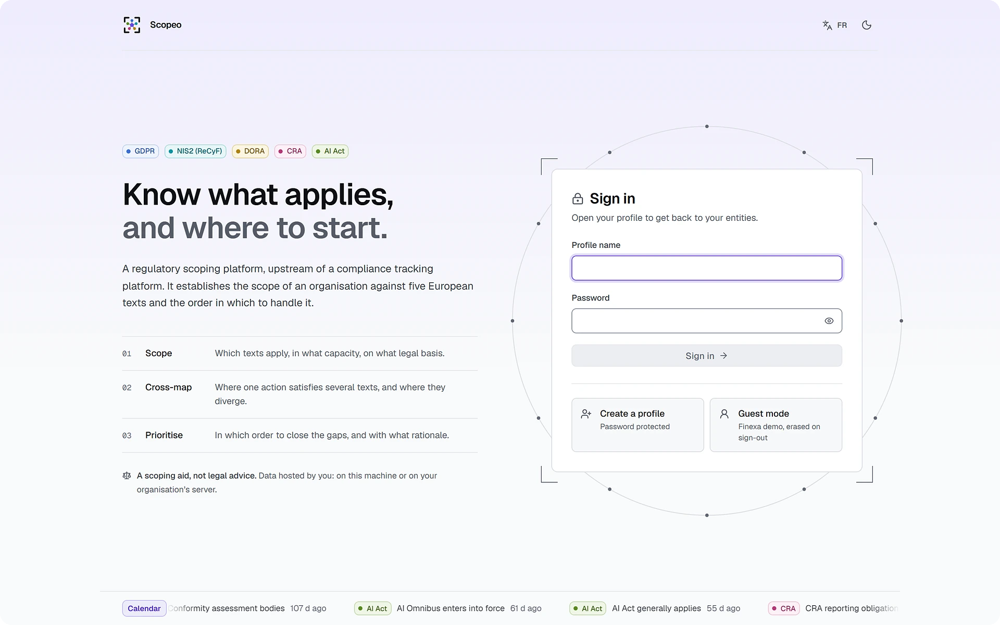

</div>

---

## Why

Five European texts now govern the security, data and AI systems of organisations. They overlap, sometimes diverge, and in some cases one overrides another (DORA over NIS2 for financial entities, for instance). Before committing a compliance budget, an organisation has to answer four questions:

1. **Which texts apply**, and in what capacity?
2. **What exactly do they require**?
3. **Where does a single action satisfy several of them**?
4. **Where to start**?

Scopeo answers them in a few hours of interviews, with reasoning that can be checked article by article, and produces the deliverables a management team expects.

> **Positioning.** The platform works **upstream**: scoping and diagnosis. It does not verify evidence or run compliance over time; those roles belong to an audit and a tracking platform, which can take over.
>
> **A scoping aid, not legal advice.** Conclusions rest on the information declared and on the state of the law at the corpus date.
>
> **Applied to France.** NIS2 is read through ANSSI's Référentiel Cyber France (ReCyF), and the authorities named are the French ones (CNIL, ANSSI, ACPR, AMF).

---

## How it works

Scopeo follows the course of a scoping engagement, from the first interview to the deliverables.

<p align="center">
  <picture>
    <source media="(prefers-color-scheme: dark)" srcset="docs/assets/en/flow-dark.svg">
    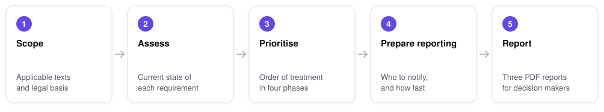
  </picture>
</p>

The first step determines which texts apply (GDPR, NIS2 (ReCyF), DORA, CRA, AI Act); each following step builds on that result. The optional ISO 27001 module, offered at the end of the first step, can pre-fill part of the assessment.

## Who it is for

| Profile | What the platform brings |
|---|---|
| Consultants and advisory firms | Scope a client in a few interviews, with reasoning that holds up article by article, and deliver board-ready reports. |
| CISO, DPO and compliance teams | See which texts apply, where one action covers several of them, and where to start. |
| Management | A two-page summary: exposure, priorities and decisions to take. |
| Legal counsel | The legal basis of every verdict, official quotations and caveats. |

---

## Features

<table>
<tr>
<td width="50%" valign="top">

### Scoping, article by article
35 questions, each tied to the article it establishes. Every verdict shows its conditions, caveats and maximum penalty. The **before / after comparator** shows which obligations enter or leave the scope when an answer changes.

</td>
<td width="50%">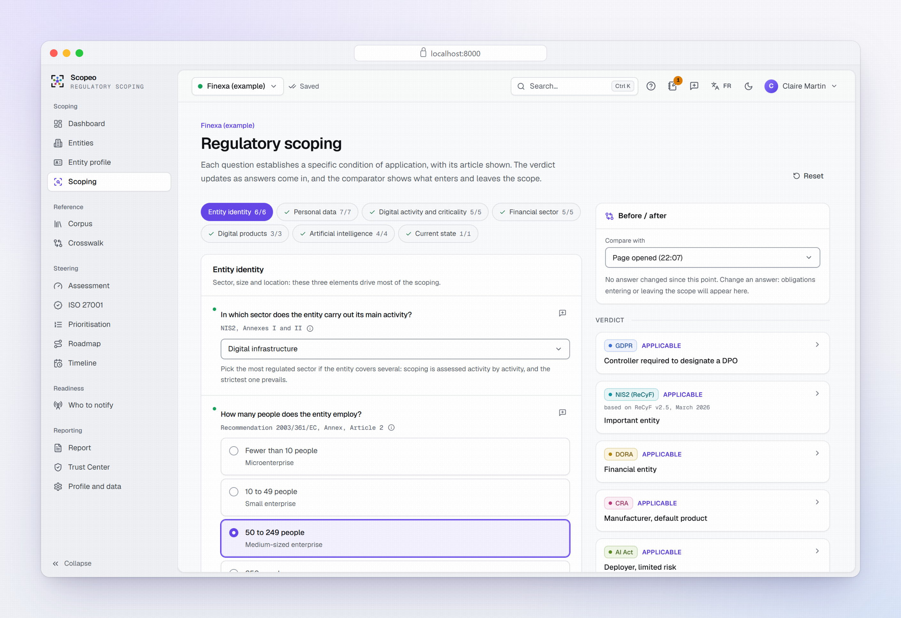</td>
</tr>
<tr>
<td width="50%">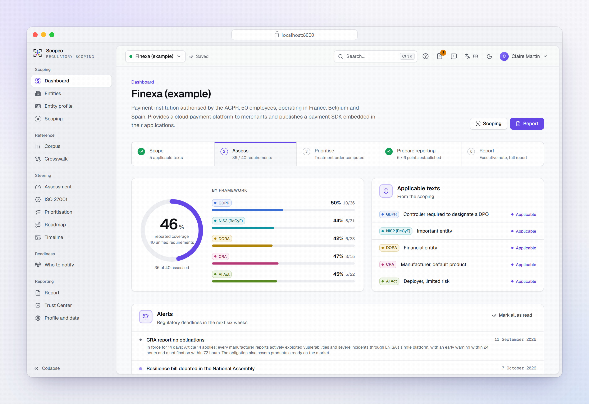</td>
<td width="50%" valign="top">

### Diagnosis at a glance
Overall and per-framework coverage, a five-step scoping path, alerts on upcoming regulatory deadlines, priorities and weaknesses by domain.

</td>
</tr>
<tr>
<td width="50%" valign="top">

### Shared requirements
40 unified requirements link the obligations of the five texts. The **Shared actions** view shows which combinations of texts a single action covers; divergences and precedence are named, with the rule that prevails.

</td>
<td width="50%">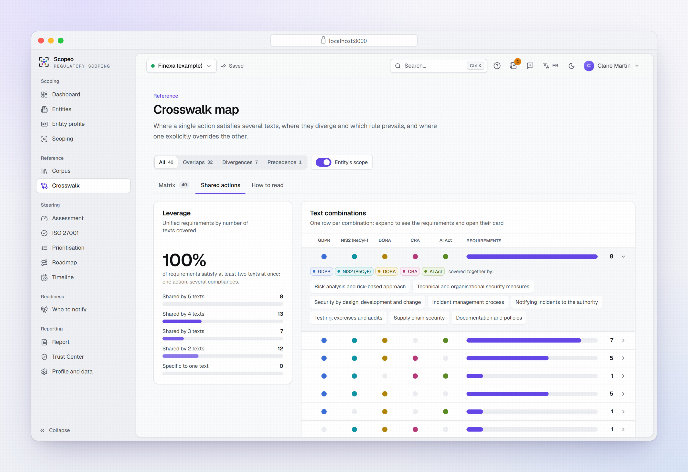</td>
</tr>
<tr>
<td width="50%">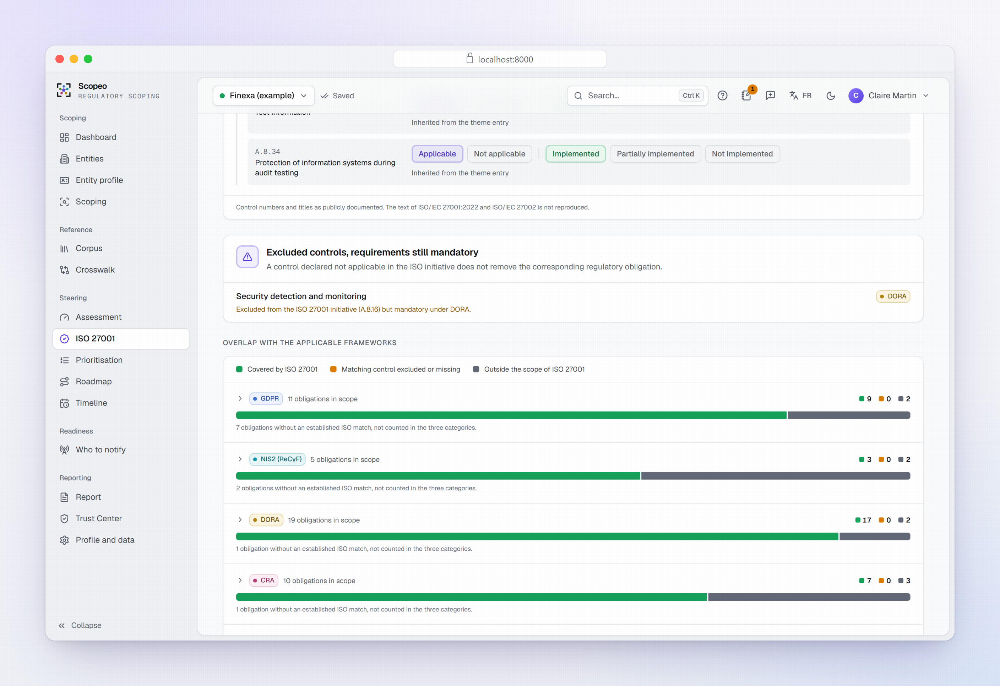</td>
<td width="50%" valign="top">

### Optional ISO 27001 module
An optional question at the end of scoping records the entity's ISO 27001 status. For a certified or compliant entity, the matching NIS2, DORA and CRA requirements can be pre-filled; they are flagged as such and remain editable. A dedicated module covers the 93 Annex A controls, Statement of Applicability import and alerts on excluded controls; the crosswalk map shows the ISO controls next to each requirement.

</td>
</tr>
<tr>
<td width="50%" valign="top">

### NIS2 detailed by the ReCyF
Under the NIS2 requirements, the **152 measures of ANSSI's ReCyF** (v2.5, March 2026 working version), filtered by entity category. A valid ISO 27001 certificate over the whole scope is recognised for objectives 2 and 16, as the ReCyF provides.

</td>
<td width="50%">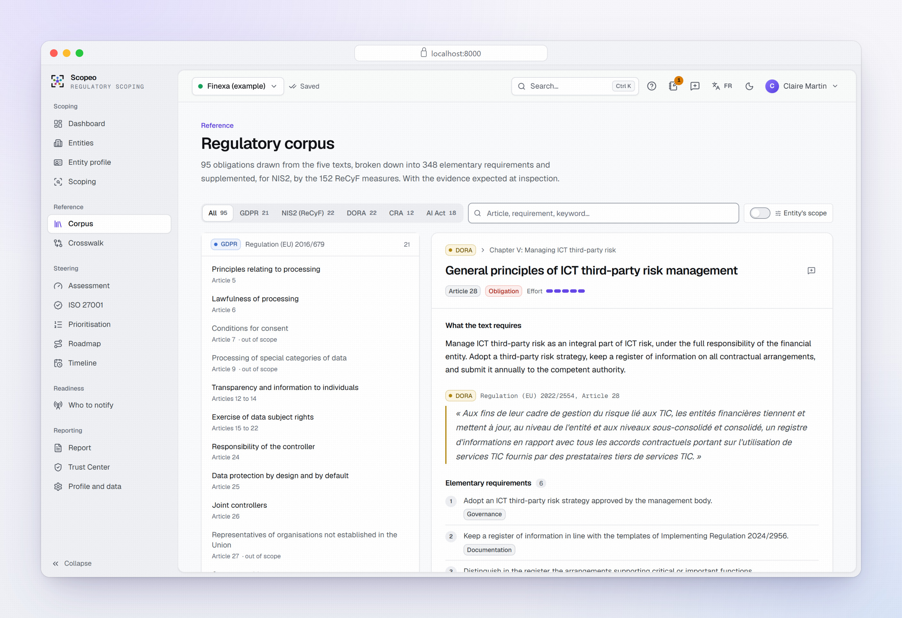</td>
</tr>
<tr>
<td width="50%">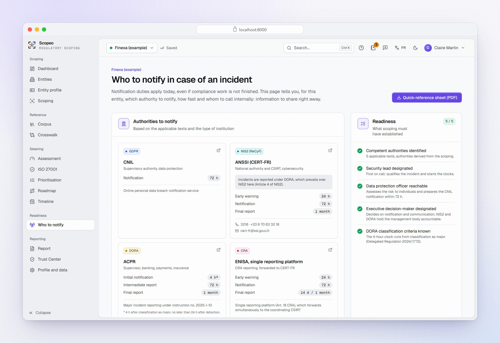</td>
<td width="50%" valign="top">

### Incident notification readiness
Notification duties apply before compliance work is done. The platform names the authorities (CNIL, ANSSI, ACPR or AMF, ENISA, market surveillance for AI), their deadlines and the internal escalation chain, points to technical support (PRIS-qualified provider, regional CSIRT, 17Cyber) and produces a one-page **incident quick-reference sheet**.

</td>
</tr>
</table>

**Also included:** three-state assessment (in place, partial, missing) · adjustable prioritisation · roadmap in four phases, from 0 to 3 months to beyond 12 months · regulatory timeline · entity profile · interview notes · read-only Trust Center (local for now) · global search (<kbd>Ctrl</kbd> + <kbd>K</kbd>) · English and French interface · light and dark themes.

### Accounts and administration

Built to be shared within a team. The first profile created is the administrator: in a separate space, it manages accounts (temporary passwords, suspension, administrator role), sign-in through the organisation's **LDAP directory** (Active Directory, OpenLDAP), global settings and a log. Each user can turn on **two-factor authentication** (TOTP) with recovery codes. An administrator never sees other people's entities, and the role is checked by the server on every request.

<details>
<summary>Dark theme preview</summary>
<br>
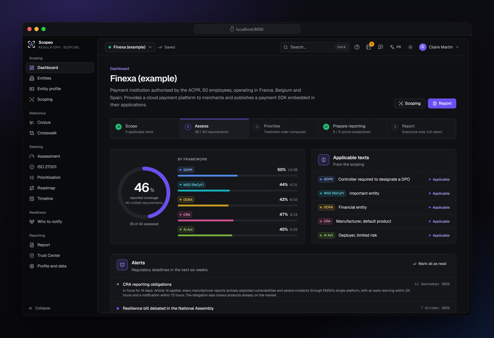
<br><br>
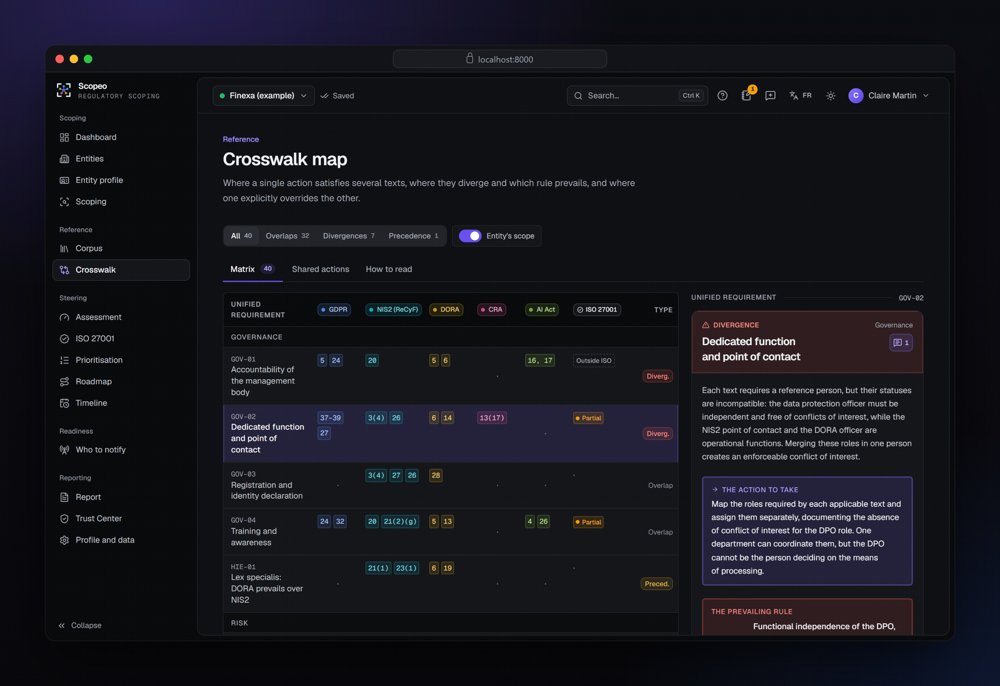
</details>

---

## Sample reports

Three PDF deliverables, generated from the fictitious demo entity *Finexa*:

| Document | Audience | Length |
|---|---|---|
| [Executive summary](docs/samples/executive-summary-finexa.pdf) | Management, executive committee | 2 pages |
| [Full scoping report](docs/samples/scoping-report-finexa.pdf) | Counsel, CISO, DPO, project team | 6 to 12 pages |
| [Incident quick-reference sheet](docs/samples/incident-quick-reference-finexa.pdf) | Internal distribution | 1 page |

---

## Quick start

> **First install?** The [step-by-step installation guide](docs/installation.md) covers every step, with no technical prerequisite.

### Docker Compose (recommended)

Prerequisite: [Docker Desktop](https://www.docker.com/products/docker-desktop/).

```bash
mkdir scopeo && cd scopeo
curl -o compose.yaml https://raw.githubusercontent.com/raymondboustany/scopeo/main/compose.yaml
docker compose up -d
```

Then open **http://localhost:8000**. Data is kept in the `scopeo-data` Docker volume.

### Without Docker

Prerequisite: [Python 3.11+](https://www.python.org/downloads/).

1. Download `scopeo-vX.Y.Z-portable.zip` from the [latest release](https://github.com/raymondboustany/scopeo/releases/latest) and unzip it.
2. Run `start.bat` (Windows, double-click) or `./start.sh` (macOS, Linux).

### From source

Prerequisites: Node.js 20+, Python 3.11+, Git.

```bash
git clone https://github.com/raymondboustany/scopeo.git
cd scopeo
npm install
npm run setup      # Python environment for the server
npm run dev        # http://localhost:5173, with hot reload
```

<details>
<summary>Commands and configuration</summary>
<br>

| Command | Purpose |
|---|---|
| `npm run dev` | API with reload and Vite interface, stopped together |
| `npm start` | Build, then serve the platform on http://127.0.0.1:8000 |
| `npm test` · `npm run test:server` | Engine tests (Vitest) · API tests (pytest) |
| `npm run lint` · `npm run typecheck` | Static checks |
| `npm run demo:build` | Regenerate the demo entity |

| Environment variable | Default | Purpose |
|---|---|---|
| `SCOPEO_PORT` | `8000` | Server port |
| `SCOPEO_HOST` | `127.0.0.1` | Listening address |
| `SCOPEO_DATA_DIR` | `server/data` (`/data` under Docker) | SQLite database folder |
| `SCOPEO_COOKIE_SECURE` | off | Mark the session cookie `Secure` when served over HTTPS |
| `SCOPEO_SECRET_KEY` | `secret.key` file in the data folder | Key encrypting security secrets (two-factor seeds, LDAP service account) |

</details>

### First steps

At first launch, the home page only offers to create the **administrator profile**. Afterwards, **Guest mode** opens the *Finexa* demo, a 50-person payment institution already scoped and assessed, erased on sign-out. To scope your own organisation or a client, create an entity from your profile; a short guided tour opens at first sign-in.

---

## Reference

| | |
|---|---|
| Texts | GDPR, NIS2 (ReCyF), DORA, CRA, AI Act |
| Obligations | 95 (GDPR 21, NIS2 22, DORA 22, CRA 12, AI Act 18) |
| Elementary requirements | 348, with expected evidence, deadlines and penalty tier |
| Unified requirements | 40, including 7 divergences and 1 precedence rule |
| NIS2 detail (ReCyF v2.5) | 20 objectives, 152 measures |
| ISO/IEC 27001:2022 | 93 Annex A controls (public titles only), mapped by theme |
| Scoping questions | 35, each tied to the article it establishes |

<details>
<summary>Status of the texts and notification deadlines</summary>
<br>

| Text | Reference | Status on 24 September 2026 |
|---|---|---|
| GDPR | Regulation (EU) 2016/679 | Applicable since 25 May 2018 |
| NIS2 | Directive (EU) 2022/2555 | Not yet transposed in France; resilience bill debated from 7 October 2026. Requirements detailed by the ReCyF v2.5, a working document that may change before the implementing decree |
| DORA | Regulation (EU) 2022/2554 | Applicable since 17 January 2025 |
| CRA | Regulation (EU) 2024/2847 | Reporting (Art. 14) since 11 September 2026; full application on 11 December 2027 |
| AI Act | Regulation (EU) 2024/1689, amended by Regulation (EU) 2026/1744 | Prohibitions and AI literacy since 2 February 2025; general application since 2 August 2026; high-risk systems on 2 December 2027 (Annex III) and 2 August 2028 (Annex I) |

| Regime | Deadlines | Basis |
|---|---|---|
| GDPR | 72 h after awareness | Art. 33 |
| NIS2 | early warning 24 h · notification 72 h · final report 1 month | Art. 23(4) |
| DORA | initial notification 4 h after classification as major, at the latest 24 h after detection · intermediate report 72 h · final report 1 month | Art. 19, Delegated Regulation (EU) 2025/301 |
| CRA | early warning 24 h · notification 72 h · final report 14 days after a fix (vulnerability) or 1 month (incident) | Art. 14 |
| AI Act | serious incident: 15 days, 10 days in case of death, 2 days for a widespread infringement or critical infrastructure | Art. 73 |

</details>

Official texts are kept as PDF, in French and in English, in [texts/](texts/README.md), with their reuse conditions. Corpus changes are recorded in the [changelog](CHANGELOG.md).

---

## Architecture

```
┌──────────────────────────────┐        ┌───────────────────────────┐
│ Interface: React, TypeScript │  /api  │ Server: FastAPI           │
│ Regulatory engines           │ ─────► │ SQLite persistence        │
│ PDF reports                  │        │ Accounts, sessions, LDAP  │
└──────────────────────────────┘        └───────────────────────────┘
```

All regulatory logic (scoping, scope, prioritisation, deadlines, ISO mapping) runs in the interface from the stored answers, so a corpus update applies at once to every existing entity. The server stores data and handles authentication.

**Stack:** React 19, TypeScript, Vite, Tailwind CSS 4, Radix UI, TanStack Query, @react-pdf/renderer · FastAPI, SQLModel, SQLite, bcrypt, pyotp, ldap3, cryptography · Vitest, pytest.

---

## Privacy and security

- Data stays on the machine: no telemetry, no call to a third-party service.
- Each profile is protected by a password, hashed with bcrypt and never stored in clear, or by the organisation's directory. Two-factor authentication (TOTP) is available to every user. Sessions are server-side, carried by an `HttpOnly`, `SameSite=Strict` cookie, and expire after a length set by the administrator.
- Security secrets are encrypted in the database. Administrators manage access, never the content of scoping work.
- The server listens on `127.0.0.1` by default. Read [SECURITY.md](SECURITY.md) before exposing it on a network.
- The Trust Center is still a demo feature: it only works locally for now. Online sharing will come in a future update.

---

## Feedback

To report a problem or suggest an improvement, use the feedback button in the platform's top bar. Choose the type of report (problem, idea, error in the regulatory content), review the message, then open a pre-filled GitHub issue or copy it to send through another channel. Nothing is sent automatically and no scoping data is attached. Security vulnerabilities must be reported privately, as described in [SECURITY.md](SECURITY.md).

---

## Contributing

Contributions are welcome, especially **corpus updates**, to be reported with an official source through the "Regulatory update" issue template. Every change proposed by a contributor goes through a pull request reviewed and approved by the maintainer. See the [contributing guide](CONTRIBUTING.md).

## Licence

Code released under the [MIT](LICENSE) licence. Regulatory texts remain the property of their authors; their reuse conditions are listed in [texts/README.md](texts/README.md). ISO/IEC 27001 control titles are cited as publicly documented; the text of the standard is not reproduced.

---

<a id="français"></a>

<div align="center">

# Scopeo (français)

**Savoir ce qui s'applique, et par quoi commencer.**

Plateforme open source de cadrage et de diagnostic réglementaire pour le **RGPD**, **NIS2**, **DORA**, le **Cyber Resilience Act** et l'**AI Act**. Elle fonctionne sur votre poste, sans service tiers.

[English](#scopeo) · **Français**

[Comment ça marche](#comment-ça-marche) · [Démarrage rapide](#démarrage-rapide) · [Fonctionnalités](#fonctionnalités) · [Rapports d'exemple](#rapports-dexemple) · [Feuille de route](ROADMAP.md) · [Contribuer](CONTRIBUTING.md)

<br>

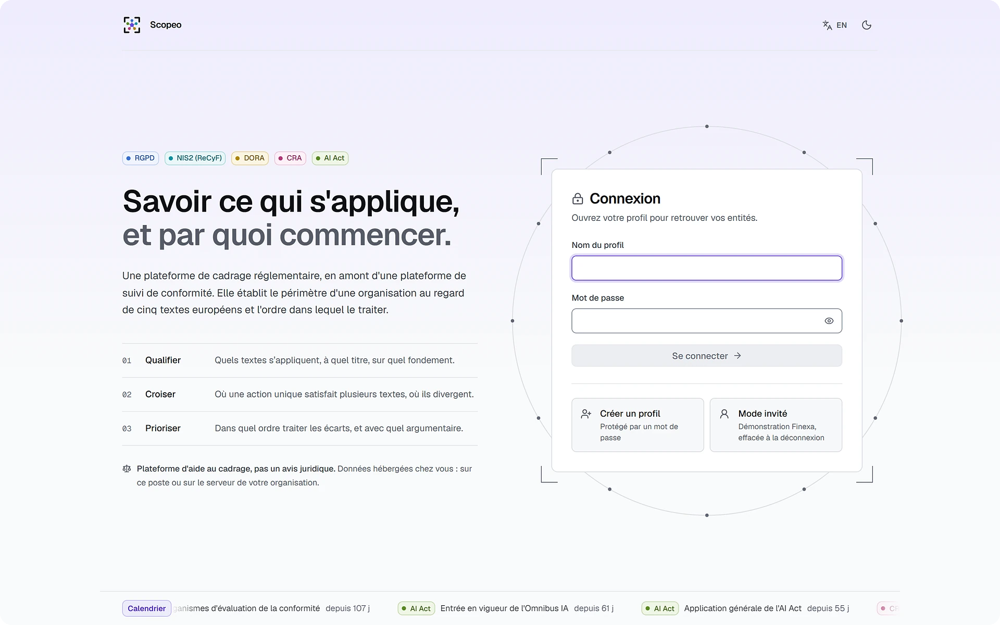

</div>

---

## Pourquoi

Cinq textes européens encadrent désormais la sécurité, les données et les systèmes d'IA des organisations. Ils se recouvrent, divergent parfois, et l'un prime sur l'autre dans certains cas (DORA sur NIS2 pour les entités financières, par exemple). Avant d'engager un budget de conformité, une organisation doit répondre à quatre questions :

1. **Quels textes s'appliquent**, et à quel titre ?
2. **Qu'exigent-ils précisément** ?
3. **Où une seule action en satisfait-elle plusieurs** ?
4. **Par quoi commencer** ?

Scopeo y répond en quelques heures d'entretien, avec un raisonnement vérifiable article par article, et produit les livrables attendus par une direction.

> **Positionnement.** La plateforme intervient **en amont** : cadrage et diagnostic. Elle ne vérifie pas de preuves et ne pilote pas la conformité dans la durée ; ces rôles reviennent à un audit et à une plateforme de suivi, qui peuvent prendre le relais.
>
> **Aide au cadrage, pas un avis juridique.** Les conclusions reposent sur les éléments déclarés et sur l'état du droit à la date du corpus.
>
> **Appliquée à la France.** NIS2 est lu à travers le Référentiel Cyber France (ReCyF) de l'ANSSI, et les autorités désignées sont les autorités françaises (CNIL, ANSSI, ACPR, AMF).

---

## Comment ça marche

Scopeo suit le déroulé d'une mission de cadrage, du premier entretien aux livrables.

<p align="center">
  <picture>
    <source media="(prefers-color-scheme: dark)" srcset="docs/assets/fr/flow-dark.svg">
    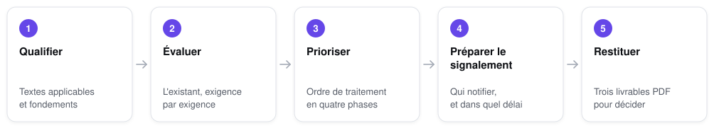
  </picture>
</p>

La première étape établit les textes applicables (RGPD, NIS2 (ReCyF), DORA, CRA, AI Act) ; chacune des suivantes s'appuie sur ce résultat. Le module ISO 27001 facultatif, proposé à la fin de la première étape, peut pré-remplir une partie de l'évaluation.

## À qui elle s'adresse

| Profil | Ce que la plateforme apporte |
|---|---|
| Consultants et cabinets de conseil | Cadrer un client en quelques entretiens, avec un raisonnement qui tient article par article, et remettre des livrables prêts pour une direction. |
| RSSI, DPO et équipes conformité | Savoir quels textes s'appliquent, où une action en couvre plusieurs, et par quoi commencer. |
| Direction | Une note de deux pages : exposition, priorités et décisions à prendre. |
| Juristes | Le fondement de chaque verdict, les citations officielles et les réserves. |

---

## Fonctionnalités

<table>
<tr>
<td width="50%" valign="top">

### Qualification, article par article
35 questions, chacune rattachée à l'article qu'elle établit. Chaque verdict expose ses conditions, ses réserves et la sanction plafond. Le **comparateur avant / après** montre les obligations qui entrent ou sortent du périmètre quand une réponse change.

</td>
<td width="50%">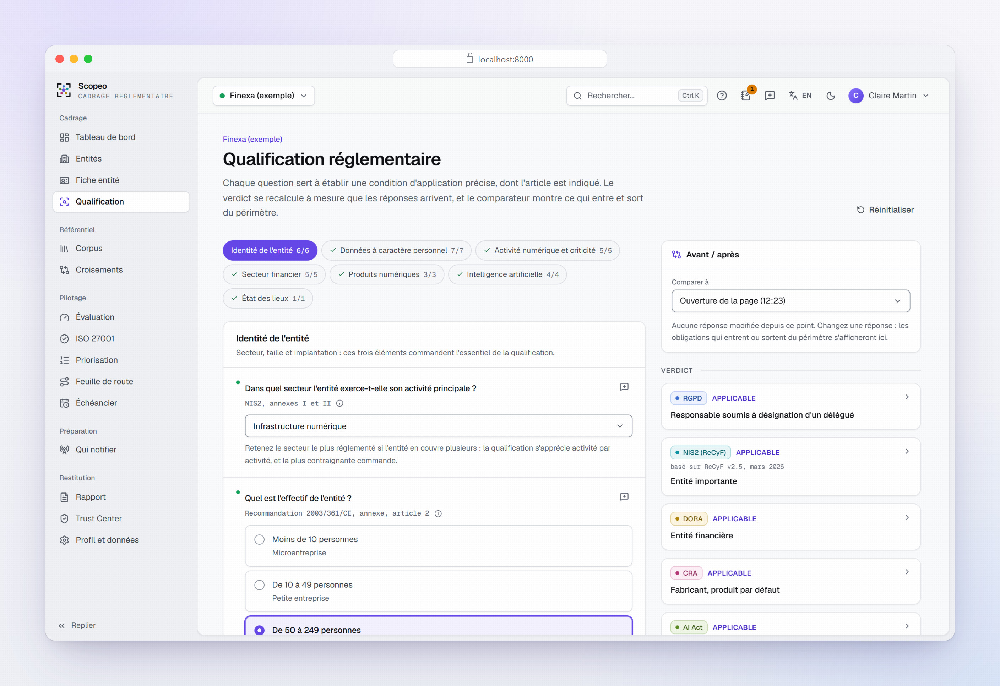</td>
</tr>
<tr>
<td width="50%"></td>
<td width="50%" valign="top">

### Diagnostic en un coup d'œil
Couverture globale et par texte, parcours de cadrage en cinq étapes, alertes sur les échéances réglementaires proches, priorités et faiblesses par domaine.

</td>
</tr>
<tr>
<td width="50%" valign="top">

### Exigences mutualisées
40 exigences unifiées relient les obligations des cinq textes. La vue **Mutualisation** montre les combinaisons de textes qu'une action unique permet de couvrir ; les divergences et hiérarchies sont nommées, avec la règle qui commande.

</td>
<td width="50%">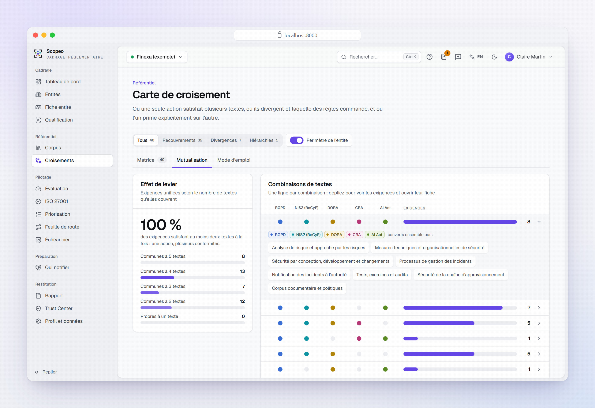</td>
</tr>
<tr>
<td width="50%">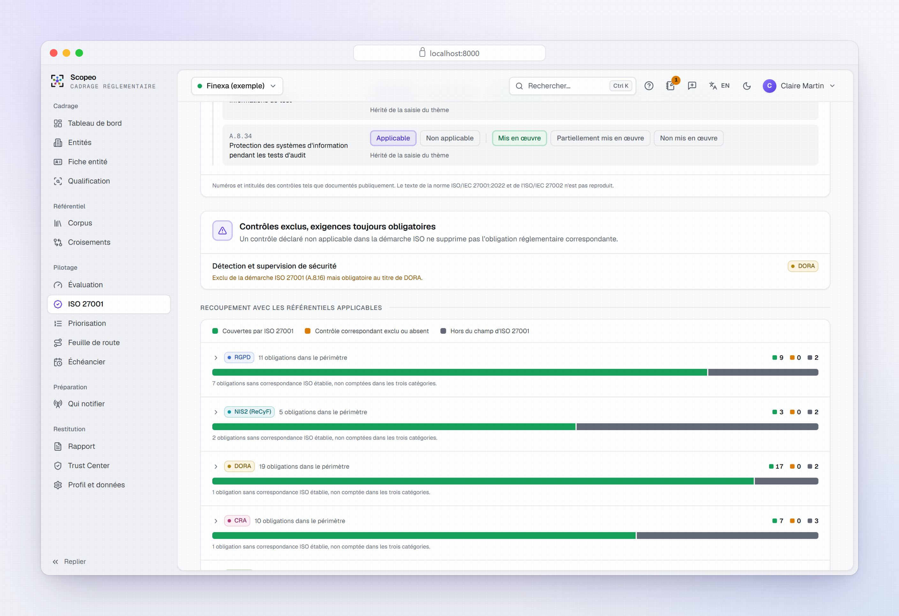</td>
<td width="50%" valign="top">

### Module ISO 27001 facultatif
Une question facultative, en fin de qualification, recueille la situation de l'entité au regard d'ISO 27001. Pour une entité certifiée ou conforme, les exigences NIS2, DORA et CRA correspondantes peuvent être pré-remplies ; elles sont signalées comme telles et restent modifiables. Un module dédié couvre les 93 contrôles de l'annexe A, l'import d'une déclaration d'applicabilité et les alertes sur les contrôles exclus ; la carte de croisement affiche les contrôles ISO en face de chaque exigence.

</td>
</tr>
<tr>
<td width="50%" valign="top">

### NIS2 détaillé par le ReCyF
Sous les exigences NIS2, les **152 mesures du ReCyF** de l'ANSSI (v2.5, version de travail de mars 2026), filtrées selon la catégorie de l'entité. Un certificat ISO 27001 valide sur tout le périmètre est reconnu pour les objectifs 2 et 16, comme le prévoit le ReCyF.

</td>
<td width="50%">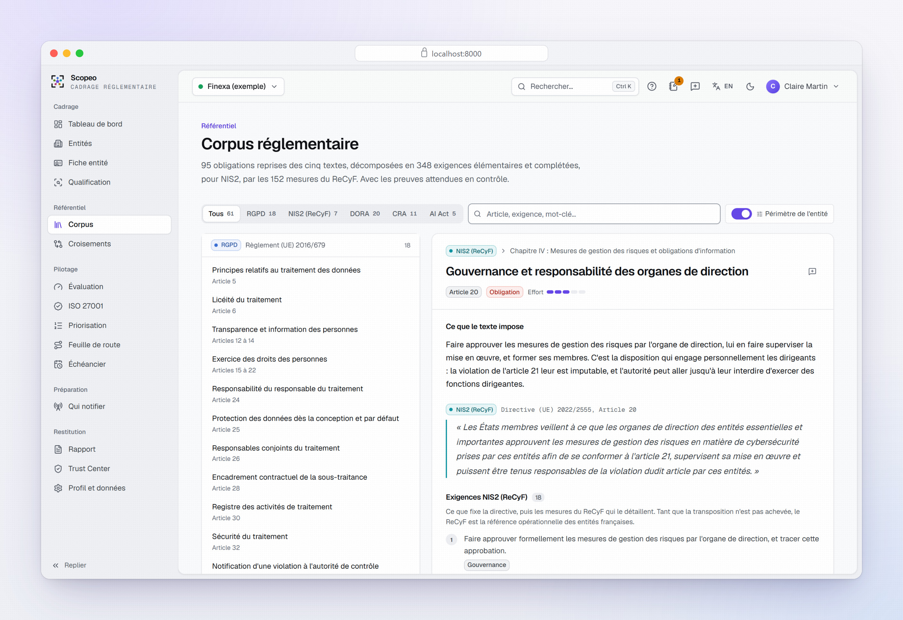</td>
</tr>
<tr>
<td width="50%">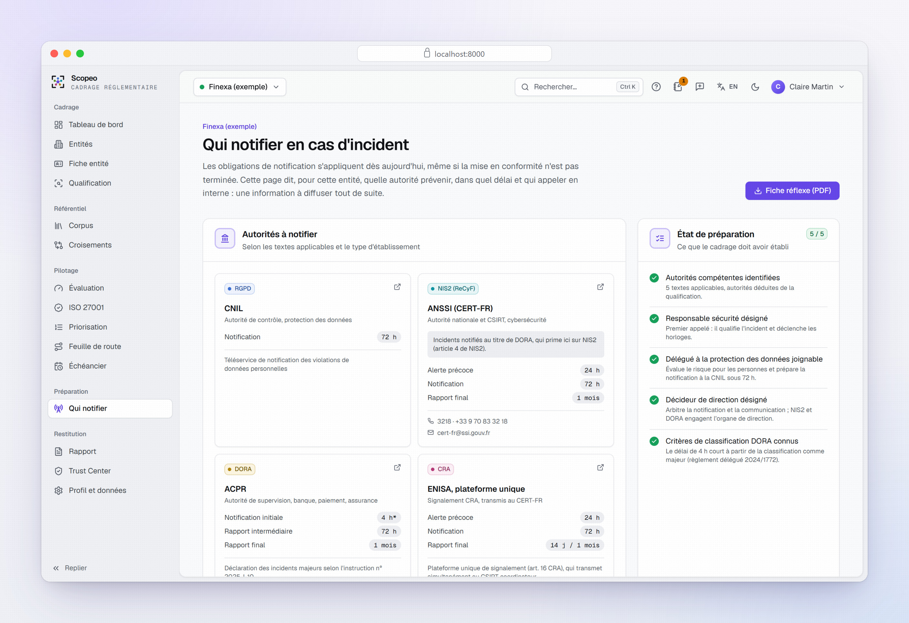</td>
<td width="50%" valign="top">

### Préparation au signalement d'incident
Les obligations de notification s'appliquent avant même la mise en conformité. La plateforme désigne les autorités (CNIL, ANSSI, ACPR ou AMF, ENISA, autorité de surveillance du marché pour l'IA), leurs délais et la chaîne d'escalade interne, indique l'appui technique à solliciter (prestataire qualifié PRIS, CSIRT territorial, 17Cyber) et produit une **fiche réflexe** d'une page.

</td>
</tr>
</table>

**Et aussi :** évaluation à trois états (en place, partiel, absent) · priorisation pondérable · feuille de route en quatre phases, de 0 à 3 mois à plus de 12 mois · échéancier réglementaire · fiche entité · notes d'entretien · Trust Center en lecture seule (local pour l'instant) · recherche transverse (<kbd>Ctrl</kbd> + <kbd>K</kbd>) · interface en français et en anglais · thèmes clair et sombre.

### Comptes et administration

Conçue pour être partagée au sein d'une équipe. Le premier profil créé est administrateur : dans un espace séparé, il gère les comptes (mots de passe provisoires, suspension, rôle administrateur), la connexion par l'**annuaire LDAP** de l'organisation (Active Directory, OpenLDAP), les réglages globaux et un journal. Chaque utilisateur peut activer la **double authentification** (TOTP) avec des codes de récupération. Un administrateur ne voit jamais les entités des autres, et le rôle est vérifié par le serveur à chaque requête.

<details>
<summary>Aperçu du thème sombre</summary>
<br>

<br><br>
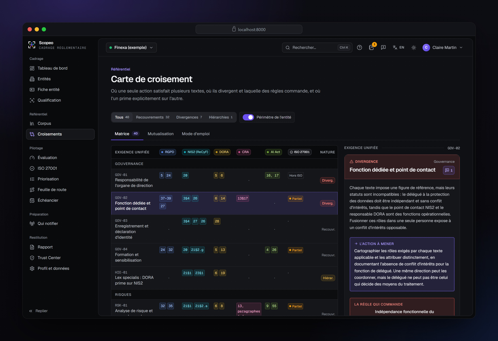
</details>

---

## Rapports d'exemple

Trois livrables PDF, générés à partir de l'entité de démonstration fictive *Finexa* :

| Document | Destinataires | Format |
|---|---|---|
| [Note au comité de direction](docs/samples/note-comex-finexa.pdf) | Direction, COMEX | 2 pages |
| [Rapport de cadrage complet](docs/samples/rapport-cadrage-finexa.pdf) | Conseil, RSSI, DPO, équipe projet | 6 à 12 pages |
| [Fiche réflexe incident](docs/samples/fiche-reflexe-finexa.pdf) | Diffusion interne | 1 page |

---

## Démarrage rapide

> **Première installation ?** Le [guide d'installation pas à pas](docs/installation.md) détaille chaque étape, sans prérequis technique.

### Docker Compose (recommandé)

Prérequis : [Docker Desktop](https://www.docker.com/products/docker-desktop/).

```bash
mkdir scopeo && cd scopeo
curl -o compose.yaml https://raw.githubusercontent.com/raymondboustany/scopeo/main/compose.yaml
docker compose up -d
```

Ouvrez ensuite **http://localhost:8000**. Les données sont conservées dans le volume Docker `scopeo-data`.

### Sans Docker

Prérequis : [Python 3.11+](https://www.python.org/downloads/).

1. Téléchargez `scopeo-vX.Y.Z-portable.zip` depuis la [dernière version](https://github.com/raymondboustany/scopeo/releases/latest) et décompressez-la.
2. Lancez `start.bat` (Windows, double-clic) ou `./start.sh` (macOS, Linux).

### Depuis les sources

Prérequis : Node.js 20+, Python 3.11+, Git.

```bash
git clone https://github.com/raymondboustany/scopeo.git
cd scopeo
npm install
npm run setup      # environnement Python du serveur
npm run dev        # http://localhost:5173, avec rechargement automatique
```

<details>
<summary>Commandes et configuration</summary>
<br>

| Commande | Rôle |
|---|---|
| `npm run dev` | API avec rechargement et interface Vite, arrêtées ensemble |
| `npm start` | Compilation, puis service de la plateforme sur http://127.0.0.1:8000 |
| `npm test` · `npm run test:server` | Tests des moteurs (Vitest) · tests de l'API (pytest) |
| `npm run lint` · `npm run typecheck` | Contrôles statiques |
| `npm run demo:build` | Régénère l'entité de démonstration |

| Variable d'environnement | Défaut | Rôle |
|---|---|---|
| `SCOPEO_PORT` | `8000` | Port du serveur |
| `SCOPEO_HOST` | `127.0.0.1` | Adresse d'écoute |
| `SCOPEO_DATA_DIR` | `server/data` (`/data` sous Docker) | Dossier de la base SQLite |
| `SCOPEO_COOKIE_SECURE` | désactivé | Marque le cookie de session `Secure` derrière HTTPS |
| `SCOPEO_SECRET_KEY` | fichier `secret.key` du dossier de données | Clé de chiffrement des secrets de sécurité (graines de double authentification, compte de service LDAP) |

</details>

### Premiers pas

Au premier lancement, l'accueil ne propose que la création du **profil administrateur**. Ensuite, **Mode invité** ouvre la démonstration *Finexa*, un établissement de paiement de 50 salariés déjà qualifié et évalué, effacée à la déconnexion. Pour cadrer votre organisation ou un client, créez une entité depuis votre profil ; un court parcours guidé s'ouvre à la première connexion.

---

## Référentiel

| | |
|---|---|
| Textes | RGPD, NIS2 (ReCyF), DORA, CRA, AI Act |
| Obligations | 95 (RGPD 21, NIS2 22, DORA 22, CRA 12, AI Act 18) |
| Exigences élémentaires | 348, avec preuves attendues, échéances et palier de sanction |
| Exigences unifiées | 40, dont 7 divergences et 1 hiérarchie |
| Détail NIS2 (ReCyF v2.5) | 20 objectifs, 152 mesures |
| ISO/IEC 27001:2022 | 93 contrôles de l'annexe A (intitulés publics uniquement), reliés par thème |
| Questions de qualification | 35, chacune rattachée à l'article qu'elle établit |

<details>
<summary>État des textes et délais de notification retenus</summary>
<br>

| Texte | Référence | État au 24 septembre 2026 |
|---|---|---|
| RGPD | Règlement (UE) 2016/679 | Applicable depuis le 25 mai 2018 |
| NIS2 | Directive (UE) 2022/2555 | Non transposée en France ; projet de loi résilience examiné à partir du 7 octobre 2026. Exigences détaillées par le ReCyF v2.5, document de travail susceptible d'évoluer avant le décret d'application |
| DORA | Règlement (UE) 2022/2554 | Applicable depuis le 17 janvier 2025 |
| CRA | Règlement (UE) 2024/2847 | Signalement (art. 14) depuis le 11 septembre 2026 ; application complète le 11 décembre 2027 |
| AI Act | Règlement (UE) 2024/1689, modifié par le règlement (UE) 2026/1744 | Pratiques interdites et maîtrise de l'IA depuis le 2 février 2025 ; application générale depuis le 2 août 2026 ; systèmes à haut risque le 2 décembre 2027 (annexe III) et le 2 août 2028 (annexe I) |

| Régime | Délais | Fondement |
|---|---|---|
| RGPD | 72 h après la prise de connaissance | art. 33 |
| NIS2 | alerte 24 h · notification 72 h · rapport final 1 mois | art. 23 § 4 |
| DORA | notification initiale 4 h après classification comme majeur, au plus tard 24 h après détection · rapport intermédiaire 72 h · rapport final 1 mois | art. 19, règlement délégué (UE) 2025/301 |
| CRA | alerte 24 h · notification 72 h · rapport final 14 jours après correctif (vulnérabilité) ou 1 mois (incident) | art. 14 |
| AI Act | incident grave : 15 jours, 10 jours en cas de décès, 2 jours pour une infraction étendue ou une infrastructure critique | art. 73 |

</details>

Les textes officiels sont conservés en PDF, en français et en anglais, dans [texts/](texts/README.md), avec leurs conditions de réutilisation. Les évolutions du corpus sont consignées dans le [journal des modifications](CHANGELOG.md).

---

## Architecture

```
┌──────────────────────────────┐        ┌───────────────────────────┐
│ Interface : React, TypeScript│  /api  │ Serveur : FastAPI         │
│ Moteurs réglementaires       │ ─────► │ Persistance SQLite        │
│ Rapports PDF                 │        │ Comptes, sessions, LDAP   │
└──────────────────────────────┘        └───────────────────────────┘
```

Toute la logique réglementaire (qualification, périmètre, priorisation, délais, correspondance ISO) s'exécute dans l'interface à partir des réponses enregistrées : une évolution du corpus s'applique donc immédiatement à toutes les entités existantes. Le serveur conserve les données et gère l'authentification.

**Pile technique :** React 19, TypeScript, Vite, Tailwind CSS 4, Radix UI, TanStack Query, @react-pdf/renderer · FastAPI, SQLModel, SQLite, bcrypt, pyotp, ldap3, cryptography · Vitest, pytest.

---

## Confidentialité et sécurité

- Les données ne quittent pas le poste : aucune télémétrie, aucun appel à un service tiers.
- Chaque profil est protégé par un mot de passe, haché avec bcrypt et jamais conservé en clair, ou par l'annuaire de l'organisation. La double authentification (TOTP) est proposée à chaque utilisateur. La session est tenue côté serveur, portée par un cookie `HttpOnly` et `SameSite=Strict`, et expire après une durée fixée par l'administrateur.
- Les secrets de sécurité sont chiffrés dans la base. Les administrateurs gèrent les accès, jamais le contenu des cadrages.
- Le serveur écoute sur `127.0.0.1` par défaut. Lisez [SECURITY.md](SECURITY.md) avant de l'exposer sur un réseau.
- Le Trust Center est encore une fonction de démonstration : il ne fonctionne qu'en local pour l'instant. Le partage en ligne arrivera dans une prochaine mise à jour.

---

## Retours

Pour signaler un problème ou proposer une amélioration, utilisez le bouton de retour dans la barre du haut de la plateforme. Choisissez la nature du signalement (problème, idée, erreur dans le contenu réglementaire), relisez le message, puis ouvrez une issue GitHub pré-remplie ou copiez-le pour l'envoyer par un autre canal. Rien n'est envoyé automatiquement et aucune donnée de cadrage n'est jointe. Les failles de sécurité se signalent en privé, comme décrit dans [SECURITY.md](SECURITY.md).

---

## Contribuer

Les contributions sont bienvenues, en particulier les **mises à jour du corpus**, à signaler avec une source officielle via le modèle d'issue « Évolution réglementaire ». Toute modification proposée par un contributeur passe par une pull request relue et approuvée par le mainteneur. Consultez le [guide de contribution](CONTRIBUTING.md).

## Licence

Code publié sous licence [MIT](LICENSE). Les textes réglementaires restent la propriété de leurs auteurs ; leurs conditions de réutilisation figurent dans [texts/README.md](texts/README.md). Les intitulés des contrôles ISO/IEC 27001 sont cités tels qu'ils sont documentés publiquement ; le texte de la norme n'est pas reproduit.
